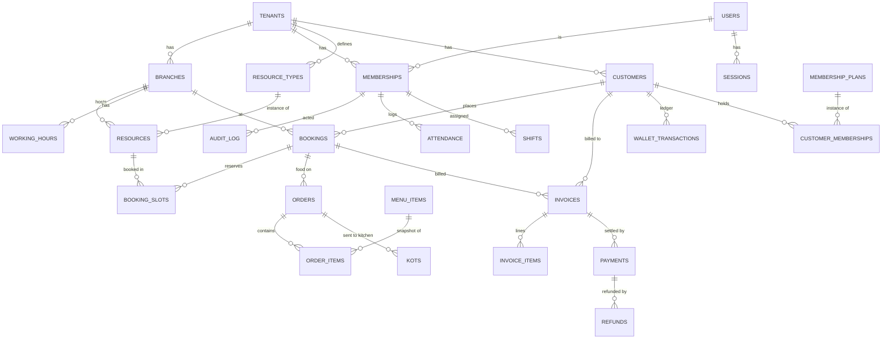

# Arena OS — Data Model (authoritative schema spec)

Column-level schema for **every MVP-1 table**, across all modules. Built tables
(`[built]`) reflect the live migrations (`db/migrations/0001–0010`); planned
tables (`[M1]`…`[M8]`) are the design each module's data-model ticket implements.

Pairs with `docs/ARCHITECTURE.md` (rationale) and `docs/ROADMAP.md` (sequencing).
When a planned table is built, update it here and mark `[built]`.

## Conventions

- **PK:** `id uuid primary key default gen_random_uuid()` unless noted.
- **Tenancy:** every business table has `tenant_id uuid not null references tenants(id) on delete cascade`. Branch-scoped tables also carry `branch_id`.
- **Timestamps:** `created_at timestamptz not null default now()`; mutable tables add `updated_at` (kept fresh by the `set_updated_at()` trigger).
- **Money:** `numeric(10,2)`, non-negative via CHECK; totals are **snapshotted** onto invoices/line-items, never recomputed from live prices.
- **Time:** absolute instants are `timestamptz`; wall-clock config (working hours) is `time`; rendered in the tenant/branch timezone.
- **Ledgers:** wallet/loyalty balances are the **sum of an append-only ledger**, not a stored mutable number.
- **RLS:** default policy `using (tenant_id in (select auth_tenant_ids())) with check (...)`, granted to `arena_app`. Tighter per-role writes noted per table. `users`/`sessions` are global identity — **never granted to `arena_app`**.
- **Scope key:** `[T]` tenant-scoped · `[T/B]` tenant + branch · `[G]` global.

## Relationship overview

---

## Identity & tenancy `[built]`

### `users` `[G]`
`id` · `email text unique not null` · `password_hash text not null` · `full_name text` · `is_platform_admin boolean not null default false` · `created_at` · `updated_at`. Not granted to `arena_app`.

### `sessions` `[G]`
`id text pk` (SHA-256 of the cookie token) · `user_id → users on delete cascade` · `expires_at timestamptz not null` · `created_at`. Index `(user_id)`. Not granted to `arena_app`.

### `tenants`
`id` · `slug text unique` (CHECK subdomain pattern) · `name text not null` · `industry tenant_industry` · `status tenant_status` · `currency text default 'INR'` · `timezone text default 'Asia/Kolkata'` · timestamps.
RLS: member `select`; owner `update`.

### `branches` `[T]`
`id` · `tenant_id` · `name text not null` · `address` · `phone` · `timezone` · `is_primary boolean` · `status branch_status` · timestamps. Unique `(tenant_id, name)`; index `(tenant_id)`. RLS: member `select`, manager write.

### `memberships` `[T/B]`
`id` · `tenant_id` · `user_id → users` · `branch_id → branches null` · `role member_role` · `status member_status` · `full_name` · `email` · `phone` · timestamps. Unique `(tenant_id, user_id)`; indexes `(user_id)`, `(tenant_id)`. RLS: member `select`, manager write.

**Enums:** `tenant_status(trial|active|suspended|cancelled)`, `tenant_industry(gaming_cafe|recording_studio|podcast_studio|dance_studio|vr_centre|other)`, `branch_status(active|inactive)`, `member_role(owner|manager|cashier|kitchen_staff|floor_staff|receptionist)`, `member_status(invited|active|disabled)`.

## Resources & booking `[built]`

### `resource_types` `[T]`
`id` · `tenant_id` · `name` · `description` · `hourly_rate numeric(10,2)` · `buffer_minutes int` · `capacity int null` · `color text` · `is_active boolean` · timestamps. Unique `(tenant_id, name)`.

### `resources` `[T/B]`
`id` · `tenant_id` · `branch_id not null` · `resource_type_id → resource_types` · `name` · `hourly_rate_override numeric null` · `status resource_status` · `sort_order int` · timestamps. Unique `(tenant_id, name)`.

### `working_hours` `[T/B]`
`id` · `tenant_id` · `branch_id not null` · `day_of_week smallint (0–6)` · `open_time time` · `close_time time` · `is_closed boolean` · timestamps. Unique `(branch_id, day_of_week)`; CHECK closed-or-close>open.

### `bookings` `[T/B]`
`id` · `tenant_id` · `branch_id` · `booking_number text` · `customer_name/phone/email` (snapshot) · `status booking_status` · `source booking_source` · `subtotal/discount/tax/total/deposit numeric` · `notes` · `created_by → memberships null` · timestamps · `checked_in_at/completed_at/cancelled_at`. Unique `(tenant_id, booking_number)`. *(M1 adds `customer_id → customers`.)*

### `booking_slots` `[T]`
`id` · `tenant_id` · `booking_id → bookings on delete cascade` · `resource_id → resources` · `starts_at timestamptz` · `ends_at timestamptz` · `rate_applied` · `slot_total` · `resource_name`/`resource_type_name` (snapshot) · `active boolean`.
**Exclusion constraint** `exclude using gist (resource_id with =, tstzrange(starts_at,ends_at) with &&) where (active)` → no overlapping active slot on a resource. Trigger syncs `active` from booking status.

**Enums:** `resource_status(available|maintenance|inactive)`, `booking_status(confirmed|checked_in|completed|cancelled|no_show)`, `booking_source(walk_in|staff|online)`.

---

## M1 — Customers `[M1]`

### `customers` `[T]`
`id` · `tenant_id` · `phone text not null` · `name` · `email` · `dob date` · `tags text[]` · `membership_status text` · `created_at` · `updated_at`. **Unique `(tenant_id, phone)`**; index `(tenant_id)`. RLS member rw.

### `customer_notes` `[T]`
`id` · `tenant_id` · `customer_id` · `body text` · `created_by → memberships null` · `created_at` · `updated_at`. Index `(customer_id)`. RLS member rw.
Editable, so it carries `updated_at` under the `set_updated_at()` trigger; an edit changes `body` only, keeping the original author and time (a note whose `updated_at` is later than its `created_at` is shown as edited). The customer link is the **composite FK** `(tenant_id, customer_id) → customers(tenant_id, id) on delete cascade` — referential integrity is not subject to RLS, so keying on the tenant too is what makes a note against another tenant's customer unwritable (same device as `bookings` in 0008).

### `wallet_transactions` `[T]`  (append-only ledger)
`id` · `tenant_id` · `customer_id → customers` · `amount numeric(10,2)` (signed: + credit / − debit) · `reason text` · `source_type text` (topup|booking|refund…) · `source_id uuid null` · `created_by → memberships null` · `created_at`. Balance = `sum(amount)`. Index `(customer_id)`.

### `loyalty_transactions` `[T]`  (append-only ledger)
`id` · `tenant_id` · `customer_id` · `points int` (signed) · `reason` · `source_type/source_id` · `created_at`. Balance = `sum(points)`.

## M1 — POS / Billing

### `invoices` `[T/B]` `[built]`
`id` · `tenant_id` · `branch_id → branches on delete restrict` · `invoice_number text` · `booking_id null` · `customer_id null` · `subtotal` · `discount` · `promo_code_id uuid null` · `tax_total` · `tax_breakup jsonb not null default '[]'` (CGST/SGST lines) · `total` · `status invoice_status(draft|issued|paid|void)` · `place_of_supply text` · `issued_at` · timestamps. **Unique `(tenant_id, invoice_number)`** (the GST per-tenant numbering rule); unique `(tenant_id, id)`; index `(tenant_id, branch_id)`; `set_updated_at()` trigger. Money columns CHECK `>= 0`.
RLS member rw (void = owner/manager, enforced in the action layer). The booking and customer links are **composite FKs** `(tenant_id, booking_id) → bookings(tenant_id, id)` and `(tenant_id, customer_id) → customers(tenant_id, id)`, both `on delete set null` — an invoice outlives the booking/customer it was raised for, and cannot point at another tenant's row (same device as `bookings` in 0008). `promo_code_id` carries no FK until `promo_codes` lands.

### `invoice_items` `[T]` `[built]`
`id` · `tenant_id` · `invoice_id` · `kind text(booking|food|membership|adjustment)` (CHECK) · `source_id uuid null` · `description text` · `qty numeric(10,2) > 0` · `unit_price` · `tax_rate numeric(5,2)` (a **percentage**, so it mirrors `tax_rates.percent`, not money) · `line_total` · `created_at` (all snapshot). Index `(invoice_id)`. Composite FK `(tenant_id, invoice_id) → invoices(tenant_id, id) on delete cascade`. `source_id` is a deliberate soft pointer — the line must survive deletion of whatever produced it.

### `payments` `[T/B]` `[built]`  (split payments = many rows per invoice)
`id` · `tenant_id` · `branch_id` · `invoice_id` · `method payment_method(cash|card|upi|online|wallet)` · `amount numeric(10,2)` CHECK `> 0` · `status payment_status(pending|captured|failed|refunded)` · `gateway text null` · `gateway_order_id/gateway_payment_id/gateway_signature text null` · `collected_by → memberships null` · `created_at` · `updated_at`. Unique `(tenant_id, id)`; index `(invoice_id)`; `set_updated_at()` trigger (a tender moves pending → captured). Composite FK `(tenant_id, invoice_id) → invoices(tenant_id, id) on delete cascade`. That `sum(amount) ≤ invoice.total` stays a service rule, not a constraint — a partial settlement is legitimate.

### `refunds` `[T]` `[built]`
`id` · `tenant_id` · `payment_id` · `amount numeric(10,2)` CHECK `> 0` · `reason` · `created_by → memberships null` · `created_at`. Index `(payment_id)`. Composite FK `(tenant_id, payment_id) → payments(tenant_id, id) on delete cascade`.
RLS: member `select`, **owner/manager write** via `auth_is_manager()`. Append-only — `arena_app` is granted `select, insert` only, so no code path can update or delete a refund record.

### `promo_codes` `[T]`
`id` · `tenant_id` · `code text` · `discount_type(percentage|fixed)` · `discount_value numeric` · `valid_from/valid_until timestamptz` · `max_uses int null` · `uses int default 0` · `is_active boolean` · timestamps. Unique `(tenant_id, upper(code))`.

### `tax_rates` `[T]`
`id` · `tenant_id` · `name text` · `percent numeric(5,2)` · `is_active boolean` · timestamps.

### `sequences` `[T]` `[built]`  (per-tenant human numbers)
`tenant_id` · `kind text(booking|invoice|kot)` (CHECK) · `period text` (e.g. YYYYMMDD or YYYY, `-` for never-resetting) · `value int >= 0`. PK `(tenant_id, kind, period)` — an upsert on that key is what serialises the increment, giving gap-free per-scope numbering. RLS tenant-scoped; granted `select, insert, update` (a counter is reset by writing 0, never deleted).

### `audit_log` `[T]` `[built]`
`id` · `tenant_id` · `actor_membership_id → memberships null` (nullable so the entry survives the staff member leaving) · `action text` · `entity_type text` · `entity_id uuid null` · `before jsonb` · `after jsonb` · `created_at`. Index `(tenant_id, created_at desc)`.
RLS: tenant `select` + tenant `insert` — deliberately **no update or delete policy**, and `arena_app` is granted `select, insert` only, so the trail cannot be rewritten or erased from the app path.

## M1 — Settings `[M1]`

### `business_profiles` `[T]`
`tenant_id pk → tenants` · `legal_name` · `gstin text` · `address` · `logo_url` · `invoice_prefix text` · `place_of_supply` · timestamps. Owner-only writes.

**Enums** `[built]`**:** `invoice_status(draft|issued|paid|void)`, `payment_method(cash|card|upi|online|wallet)`, `payment_status(pending|captured|failed|refunded)`.

---

## M2 — Food & Kitchen `[M2]`

### `menu_categories` `[T]`
`id` · `tenant_id` · `name` · `sort_order int` · `is_active boolean` · timestamps. Unique `(tenant_id, name)`.

### `menu_items` `[T]`
`id` · `tenant_id` · `category_id → menu_categories` · `name` · `price numeric(10,2)` · `tax_rate_id → tax_rates null` · `status(available|out_of_stock|hidden)` · `image_url` · `happy_hour_eligible boolean` · timestamps.

### `happy_hours` `[T]`
`id` · `tenant_id` · `name` · `days_of_week smallint[]` · `start_time/end_time time` · `discount_type/discount_value` · `is_active boolean` · timestamps.

### `orders` `[T/B]`
`id` · `tenant_id` · `branch_id` · `booking_id → bookings null` · `order_number text` · `status(open|billed|cancelled)` · `created_by → memberships null` · timestamps.

### `order_items` `[T]`
`id` · `tenant_id` · `order_id → orders on delete cascade` · `menu_item_id → menu_items null` · `item_name`/`unit_price`/`tax_rate` (snapshot) · `qty int` · `line_total` · `special_instructions text`.

### `kots` `[T/B]`
`id` · `tenant_id` · `branch_id` · `order_id → orders` · `kot_number text` · `status kot_status(pending|preparing|ready|served|cancelled)` · `created_at` · `updated_at`. Kitchen queue = open KOTs. `kitchen_staff` may update `status`.

---

## M3 — Public booking, Payments, Notifications `[M3]`

*(Public booking reuses `bookings`/`booking_slots`/`customers`; deposits use `payments` with `method=online`.)*

### `payment_settings` `[T]`
`tenant_id pk` · `provider text default 'razorpay'` · `key_id text` · `key_secret_encrypted bytea` (envelope-encrypted; never returned plaintext) · `webhook_secret_encrypted bytea` · `deposit_type(percentage|fixed)` · `deposit_value numeric` · `is_live boolean` · timestamps. Owner-only.

### `notification_settings` `[T]`
`tenant_id pk` · `sms_provider text` · `sms_sender_id text` · `dlt_templates jsonb` (event → template id) · `enabled boolean` · timestamps.

### `notifications` `[T]`  (outbox)
`id` · `tenant_id` · `channel(sms|email|inapp)` · `to_address text` · `template_key text` · `payload jsonb` · `status(queued|sent|failed)` · `attempts int` · `last_error text` · `booking_id null` · `created_at` · `sent_at`. Index `(tenant_id, status)`.

**Booking QR:** `bookings` gains `qr_token text` (unguessable) for `/b/{number}` check-in.

---

## M4 — Employee management

### `attendance` `[T/B]` `[built]`
`id` · `tenant_id` · `branch_id` · `membership_id → memberships` · `work_date date` · `clock_in timestamptz` · `clock_out timestamptz null` · `is_manual boolean` · `note text` · timestamps. Index `(tenant_id, work_date)`, `(membership_id)`. One row per (membership, work_date) in the common case — staff clock in/out their own row; managers may add/correct any row (marks `is_manual = true`). RLS: any active member rw (tenant-scoped); action layer restricts staff to their own membership.

### `rosters` `[T/B]` `[built]`
`id` · `tenant_id` · `branch_id` · `week_start date` · `note text` · timestamps. Unique `(branch_id, week_start)` — one roster per branch per week; the builder upserts on this key.

### `shifts` `[T/B]` `[built]`
`id` · `tenant_id` · `branch_id` · `membership_id → memberships` · `roster_id → rosters null` · `shift_date date` · `type shift_type(morning|evening|night)` · `starts time` · `ends time` · timestamps. Index `(membership_id, shift_date)`. RLS: any active member rw (staff can see the whole roster); action layer restricts building/editing to managers.

**Enums:** `shift_type(morning|evening|night)`.

### `tasks` `[T/B]` `[built]`
`id` · `tenant_id` · `branch_id null` · `title` · `description` · `assigned_to → memberships null` · `status task_status(open|in_progress|done)` · `due_date date null` · `created_by → memberships null` · timestamps. Index `(assigned_to)`. RLS: any active member rw; action layer restricts create/reassign/delete to managers, status updates to the assignee or a manager.

**Enums:** `task_status(open|in_progress|done)`.

*(Performance metrics are **derived** — no table — from `payments.collected_by`, `bookings.created_by`, `attendance`.)*

---

## M5 — Membership & wallet `[M5]`

### `membership_plans` `[T]`
`id` · `tenant_id` · `name` · `price numeric` · `duration_days int` · `benefits jsonb` (`{booking_discount_pct, food_discount_pct, free_hours, credits, special_pricing}`) · `is_active boolean` · `display_order int` · timestamps.

### `customer_memberships` `[T]`
`id` · `tenant_id` · `customer_id → customers` · `plan_id → membership_plans` · `starts_at` · `expires_at` · `is_active boolean` · `amount_paid numeric` · `invoice_id → invoices null` · timestamps. Index `(customer_id, is_active)`, `(expires_at)`.

*(Wallet & loyalty use `wallet_transactions`/`loyalty_transactions` from M1. Wallet as a tender = a `payments` row with `method=wallet` + a debit ledger entry.)*

---

## M6 — Reports `[M6]`

Read-only. No new base tables; prefer **materialized views** / rollups over
`bookings`, `booking_slots`, `invoices`, `payments`, `orders`,
`customer_memberships`, `attendance` — refreshed on a schedule. Examples:
`mv_daily_revenue(tenant_id, branch_id, day, gross, discount, tax, net)`,
`mv_resource_occupancy(tenant_id, resource_id, day, booked_minutes, open_minutes)`.
All filtered by `tenant_id`; export to CSV. (Add a `report_snapshots` table only if
historical immutability is needed.)

---

## M7 / M8 — Hardening & launch `[M7]` `[M8]`

Mostly non-schema (infra, security, ops). Schema touches:
- `audit_log` coverage extended to role/company/gateway-key changes (table exists from M1).
- Optional `rate_limits` (or Redis/edge KV) for throttling counters — likely **not** a Postgres table (use edge KV).
- Data-lifecycle: per-tenant **export** (read) + **hard-delete** (cascades via `tenant_id ON DELETE CASCADE`, already in place).
- Later/deferred: `tenant_domains(tenant_id, hostname unique, verified_at)` for custom domains.

---

## M11 — Payroll & Salary `[M11]`

### `salary_structures` `[T]` `[built]`
`id` · `tenant_id` · `membership_id → memberships` · `base numeric(10,2)` · `allowances jsonb` (`SalaryComponent[] = {label, amount}[]`) · `deductions jsonb` (same shape) · `effective_from date` · `created_by → memberships null` · timestamps. Unique `(membership_id, effective_from)` — a raise is a new row dated from when it takes effect, never a rewrite of an old one, so past pay stays reconstructable once the payroll run (AROS-104) starts snapshotting payslips from this. RLS: **owner-only** for select AND write via `auth_role_in() = 'owner'` — compensation is more sensitive than the business's own legal identity (`business_profiles`, which is member-select/owner-write).

### `employee_advances` `[T]` `[built]`
`id` · `tenant_id` · `membership_id → memberships` · `amount numeric(10,2)` · `instalment_amount numeric(10,2)` · `note text null` · `given_at date` · `created_by → memberships null` · timestamps. Unique `(tenant_id, id)` (composite-FK target for the recoveries ledger below). The PLAN side only — who was given how much and the flat instalment to recover each payroll period. RLS: owner-only, same as `salary_structures`.

### `employee_advance_recoveries` `[T]` `[built]`  (append-only ledger)
`id` · `tenant_id` · `advance_id → employee_advances` · `amount numeric(10,2)` (signed: + recovery / − correction) · `source_type text null` (`'payroll'`, written by AROS-104) · `source_id uuid null` (the payslip, a soft pointer — no FK, same device as `invoice_items.source_id`) · `created_by → memberships null` · `created_at`. Composite FK `(tenant_id, advance_id) → employee_advances(tenant_id, id) on delete cascade`. Index `(advance_id)`. Outstanding is always **derived** as `employee_advances.amount − sum(recoveries.amount)`, never a stored column — same shape as `wallet_transactions`/`loyalty_transactions` (M5). RLS: owner-only. Grants: **select, insert only** (no update/delete) — stricter than wallet/loyalty, matching `refunds`: a payroll deduction record must never be editable after the fact, only reversed with an opposite-signed row.

### `payslips` `[T]` `[built]`
`id` · `tenant_id` · `membership_id → memberships` · `period text` (`'YYYY-MM'`, check-constrained) · `base numeric(10,2)` · `allowances jsonb` · `deductions jsonb` (both snapshotted verbatim from the `salary_structures` row used — the "line breakdown") · `days_in_period smallint` · `days_present smallint` · `gross numeric(10,2)` (`(base + Σallowances) × days_present / days_in_period`, rounded once) · `deductions_total numeric(10,2)` (Σdeductions, **not** prorated by attendance) · `advance_instalment numeric(10,2)` (what this payslip actually recovered, clamped to both outstanding balance and what the payslip can afford) · `net_pay numeric(10,2)` (floored at 0 — a payslip never prints negative) · `created_by → memberships null` · `created_at`. Unique `(membership_id, period)` — the idempotency guarantee: the run (`lib/payroll/run.ts`) pre-checks for an existing payslip in the period and blocks the whole run rather than upserting, because upserting would mean re-posting advance recoveries the (insert-only) ledger can never un-post. RLS (AROS-105, migration 0030): **SELECT** is self-service — `membership_id = auth_membership_id(tenant_id)` — plus owner/manager see every row (`auth_is_manager`), deliberately wider than `salary_structures`/`employee_advances`, since a payslip is "about" the employee it belongs to the way attendance is. **INSERT** stays owner-only, unchanged from 0029. Grants: **select, insert only** — a payslip is a financial record of what was actually paid, corrected by the next run rather than edited in place.

---

## Change log

- 2026-08-01 — Initial full spec. Built tables reflect migrations 0001–0005;
  M1–M8 are the target schema per their data-model tickets. Update table blocks
  to `[built]` as migrations land, keeping `db/schema.ts` in sync.
- 2026-08-05 — Migration 0006 adds `attendance` (M4-A): clock in/out, manager
  correction, marked `[built]`.
- 2026-08-05 — Migration 0007 adds `rosters`/`shifts` (M4-B): weekly roster
  builder, staff shift assignment, marked `[built]`.
- 2026-08-05 — Migration 0008 adds `tasks` (M4-C): manager assigns, assignee
  tracks status, marked `[built]`.
- 2026-08-06 — `customer_notes` gains `updated_at` (notes are now editable from
  the profile) and a composite `(tenant_id, customer_id)` FK — migration 0009.
- 2026-08-07 — Billing data model built — migration 0010: `invoices`,
  `invoice_items`, `payments`, `refunds`, `sequences`, `audit_log` plus the
  `invoice_status` / `payment_method` / `payment_status` enums. `bookings` gains
  a `unique (tenant_id, id)` key so invoices can use the composite-FK device.
- 2026-08-07 — `promo_codes` (0011) and `business_profiles` (0012) built, so an
  invoice's `promo_code_id` now carries a composite FK and the invoice prefix
  comes from the tenant's profile rather than a constant.
- NOTE — the customer/billing branch and the employee/menu/orders branch were
  developed in parallel and BOTH numbered their migrations 0006–0013, so the
  directory currently holds two files per number (e.g. `0010_billing.sql` and
  `0010_menu.sql`). The runner applies them in filename order, which happens to
  satisfy every dependency, but the numbering needs reconciling.
- 2026-08-19 — `salary_structures` (M11, first ticket) built — migration 0027:
  base pay + allowances/deductions per membership, versioned by
  `effective_from` so a raise never overwrites past pay. Owner-only RLS for
  both read and write. Foundation for the payroll run (AROS-104).
- 2026-08-19 — `employee_advances` + `employee_advance_recoveries` (M11,
  second ticket) built — migration 0028: staff advances/loans plus their
  append-only recovery ledger, outstanding always derived (never stored),
  same shape as the wallet/loyalty ledgers. The recoveries table is
  insert-only at the grant level (like `refunds`), stricter than
  wallet/loyalty. The payroll run (AROS-104) will write recovery rows as it
  deducts each period's instalment.
- 2026-08-19 — `payslips` (M11, third ticket, AROS-104) built — migration
  0029: the payroll run's output. One row per (membership, period), every
  money/attendance figure a snapshot so a later salary-structure edit or
  attendance correction never rewrites a past payslip. Unique
  `(membership_id, period)` makes a run idempotent — a re-run of a period
  that already has payslips is rejected outright rather than upserting, since
  the advance-recoveries ledger it posts to is insert-only and can't be
  un-posted. Owner-only RLS, select+insert-only grants, same as
  `employee_advance_recoveries`.
- 2026-08-19 — payslip self-view (M11, fourth ticket, AROS-105) — migration
  0030: widened `payslips` SELECT so a staff member sees their own payslips
  (new `auth_membership_id()` helper, same SECURITY DEFINER shape as
  `auth_role_in()`) while owner/manager keep seeing everyone's. INSERT is
  unchanged — still owner-only, only the payroll run writes these.
- 2026-08-19 — Payroll Cost Report (M11, fifth ticket) — `lib/reports/payroll.ts`
  + `/reports/payroll`, manager-guarded. No schema change: aggregates
  `payslips` by period range, per-employee and total (the wage-bill figure
  M12's P&L, AROS-86, will read). The ticket named the M6-D "reporting infra"
  epic (AROS-64, a tenant-safe `security_barrier` view + CSV pattern) as a
  dependency, but that epic was never built in this codebase — this instead
  follows the plain RLS-scoped aggregate-query pattern `getEmployeeAnalytics()`
  (M6-C) already established, plus a new reusable client-side CSV export
  (`components/reports/ExportCsvButton.tsx`, no library, no server round trip).
- 2026-08-26 — platform subscription billing (M16 #3) — migration 0079.
  Arena OS now charges its tenants through **its own** Razorpay account, kept
  rigorously apart from the per-venue gateway `payment_settings` describes:

  * **`platform_payment_settings`** `[P]` — a SINGLETON (`id boolean pk check (id)`)
    holding `razorpay_key_id` · `razorpay_key_secret_encrypted` ·
    `razorpay_webhook_secret_encrypted` · timestamps. Same AES-256-GCM contract
    and same `^v[0-9]+:` CHECK as `payment_settings`, but sealed with the fixed
    AAD `'platform:razorpay'` rather than a tenant id, so the two accounts'
    ciphertexts are not interchangeable. RLS enabled with **no policies and no
    grants to `arena_app`** — the strictest table in the schema; the only reader
    is `lib/platform/billing/credentials.ts` on the owner connection.
  * **`plans`** gains `gateway` · `gateway_monthly_plan_id` ·
    `gateway_annual_plan_id`. Two ids because monthly and annual are two
    different prices and a Razorpay plan object carries its own amount; the
    subscribe path reads the column matching the requested period with **no
    fallback**, which is what makes "billed on the wrong cycle" unreachable.
    Partial unique indexes per column; the cross-column case is checked in
    `setPlanGateway()`.
  * **`tenant_subscriptions`** gains `gateway_customer_id` ·
    `cancel_at_period_end` · `gateway_last_payment_id`. `gateway` and
    `gateway_subscription_id` (0078) are reused unchanged, and
    `idx_tenant_subscriptions_gateway_ref` is what guarantees a webhook resolves
    to at most one row. A pending cancellation is its own boolean rather than an
    early `cancelled_at`, because the 0078 CHECK ties `cancelled_at` to
    `status = 'cancelled'` exactly.
  * **`webhook_events`** gains `subscription_id`. The table is reused rather than
    duplicated; the platform stream is `gateway = 'platform_razorpay'`, so the
    two accounts' deliveries are separable and their event ids cannot collide.
    `order_id` is deliberately left alone — a subscription is not an order.
  * **No new enum values.** The lifecycle is expressed across the two enums that
    already exist: `tenant_subscription_status` (0078) carries `past_due`, and
    `tenant_status` (0001) carries `suspended`/`cancelled`. "Suspended" is an
    ACCOUNT state whose subscription is `expired`. The full Razorpay-state →
    local-state table lives in `lib/platform/billing/lifecycle.ts`.
  * **`tenants.status` is no longer writable by `arena_app`.** 0002 granted the
    role a blanket UPDATE and gave tenant owners `tenants_owner_update`; that was
    harmless while `status` was operator bookkeeping, and is not now that
    suspension for non-payment writes it. Replaced with a column-level grant on
    `(name, industry, currency, timezone)`, so an UPDATE mentioning `status` (or
    `slug`) fails with 42501 before RLS is consulted. Platform admin writes are
    unaffected — they go through the owner connection.
- 2026-08-26 — recurring billing + GST tenant invoices (M16 #4) — migration 0052.
  The document a subscription charge produces. Arena OS is the SUPPLIER here;
  `invoices` (0018) is a venue billing its own customers and is untouched.

  * **`platform_invoices`** `[P/T]` — `tenant_id` · `subscription_id → tenant_subscriptions`
    (RESTRICT) · `plan_id → plans` (RESTRICT) · `kind platform_invoice_kind(subscription|credit_note)`
    · `invoice_number unique` · `invoice_date` · `period` (financial year) ·
    `billing_period_start/end` · `billing_period_type billing_period` · then the
    SNAPSHOTS (`plan_name`, `plan_price`, `seller_*`, `buyer_*`, `place_of_supply`)
    and the money (`subtotal`, `adjustment`, `taxable_value`, `gst_rate`, `cgst`,
    `sgst`, `igst`, `tax_total`, `total`, `currency`) · `status invoice_status`
    (the 0018 enum, reused) · gateway refs (`gateway`, `gateway_payment_id`,
    `gateway_subscription_id`, `gateway_invoice_id`, `gateway_event_id`) ·
    `document_url` · `notes` · `created_at`.

    The arithmetic is enforced by CHECK, not by trust:
    `taxable_value = subtotal − adjustment − tax_total`,
    `tax_total = cgst + sgst + igst`, `total = taxable_value + tax_total`,
    `adjustment <= subtotal`, every money column `>= 0`, and
    `igst = 0 or (cgst = 0 and sgst = 0)` — CGST+SGST **or** IGST, never both.
    So a rounding bug is a failed INSERT rather than a wrong bill, and a negative
    invoice is unrepresentable.

    **Money-level idempotency** is `idx_platform_invoices_gateway_payment`, a
    partial unique index on `(gateway, gateway_payment_id)` — the same device
    0034 used for deposits. The `webhook_events` event-id claim stops a repeat
    DELIVERY; this stops one PAYMENT arriving under several event ids from
    becoming two invoices, two numbers and two lots of GST.

    RLS: **owner-only** SELECT (`auth_role_in(tenant_id) = 'owner'`, the helper
    0020 uses for `business_profiles`) — narrower than `invoices`, because what a
    business pays Arena OS is the proprietor's own commercial information.
    `arena_app` is granted SELECT and nothing else; invoices are written only by
    the platform webhook on the owner connection.

  * **`platform_billing_settings`** `[P]` — singleton letterhead:
    `seller_legal_name` · `seller_gstin` · `seller_address` · `seller_state_code`
    · `gst_rate numeric(5,2) default 18` · `invoice_prefix` · `credit_note_prefix`.
    No policies, no grants — every value is snapshotted onto each invoice, so no
    tenant ever needs to read the live row.

  * **`platform_sequences`** `[P]` — `(kind, period) → value`, the same
    insert-on-conflict-bump idiom as `sequences` (0018) minus `tenant_id`,
    because GST numbering belongs to the SUPPLIER. Numbers are formatted by the
    same `formatInvoiceNumber()` and restart on 1 April. No grants.

  * **GST is TAX-INCLUSIVE**, and that is forced rather than chosen: M16 #3's
    subscribe path refuses a subscription unless the Razorpay plan amount equals
    the catalogue price exactly, so the captured rupees *are* the price. Tax is
    extracted (`taxable = total ÷ (1 + rate/100)`; `tax = total − taxable`, by
    subtraction so the two sum exactly), and the CGST/SGST halves are
    `cgst = round2(tax/2)`, `sgst = round2(tax − cgst)` so they sum to the paisa.
    `round2()` from `lib/billing/pricing.ts` is reused throughout; `priceBill()`
    is deliberately untouched.

  * **Proration**: a mid-cycle plan change raises a positive-valued CREDIT NOTE
    for the unused remainder of the paid period
    (`lastPaidInvoiceTotal × unusedDays ÷ periodDays`, whole days, capped at the
    amount paid), which is then applied as `adjustment` on the next charge.
    Upgrade and downgrade use the identical rule. See `lib/platform/billing/proration.ts`.

- 2026-08-28 — dunning & suspension on failed payment (AROS-113) — migration 0081.
  The last item 0078 deferred. **No new enum value, no new status column, no
  second lifecycle**: `active → past_due → suspended → cancelled` is already
  expressible across the two enums, and 0079 wrote the mapping down. What 0081
  adds is the CLOCKS that let the lifecycle run on a schedule rather than only
  on a webhook.

  * **`tenant_subscriptions`** gains `past_due_since` · `suspended_at` ·
    `last_payment_failure_at` · `last_payment_failure_reason`
    (non-blank, ≤ 300 chars by CHECK, because it is gateway-authored text that
    reaches a page). A CHECK forbids `suspended_at < past_due_since`, and the
    partial index `idx_tenant_subscriptions_dunning (past_due_since) where
    past_due_since is not null` is the scheduled processor's only scan.

    `past_due_since` is the anchor for grace, **not** `current_period_end`: a
    failed renewal leaves `current_period_end` in the PAST, because Razorpay
    does not extend a period it could not charge for. Measuring grace from the
    period end would give every business a grace period of zero. Both clocks are
    set once per arrears episode (`?? now`, never overwritten, so a redelivered
    webhook cannot restart a half-spent grace period) and cleared on a
    successful charge, which is the whole of `suspended → active`.

    **Backfill**: rows already in `past_due` get `past_due_since = now()` — a
    full fresh grace window from deploy, deliberately generous, because the
    historical failure date was never recorded and suspending an existing
    arrears account on the job's first run would be a surprise, not a policy.

  * **`platform_dunning_notices`** `[P/T]` — `tenant_id` (CASCADE) ·
    `subscription_id → tenant_subscriptions` (RESTRICT) · `dunning_cycle` ·
    `stage` (CHECK: `payment_failed | grace_reminder | final_warning |
    suspended | cancelled`) · `channel` · `sent_at`.

    **Not a notification framework** — this project has no email or SMS
    provider, and the table does not pretend otherwise. It is a delivery LOG,
    modelled on `webhook_events`, and its whole job is
    `idx_platform_dunning_notices_once (subscription_id, dunning_cycle, stage)`:
    the unique index that stops an hourly job sending the same warning
    twenty-four times a day. Delivery is one injectable function in
    `lib/platform/billing/dunning-notify.ts`.

    `dunning_cycle` is the EPISODE key — the `past_due_since` that anchored the
    run. So each stage is sent once per episode, and a business that recovers
    and fails again months later is warned afresh rather than silenced forever
    by a notice it received in the spring.

    RLS: **owner-only** SELECT (`auth_role_in(tenant_id) = 'owner'`, as
    `platform_invoices`), SELECT the only grant. A business therefore cannot
    forge a notice to dodge a reminder, nor delete the record that it was
    warned.

  * **Audit** reuses `audit_log` (0018) — no second history table. Entries are
    `action = 'subscription.<new status>'`, `entity_type = 'tenant_subscription'`,
    `actor_membership_id = NULL` (nobody in the business did this), and an
    `after` payload naming the source (`webhook` | `dunning_job`). Written only
    on a genuine status transition, in the same transaction, so a replayed
    webhook cannot pad the trail.

- 2026-08-28 — platform billing dashboard (AROS-114) — migration 0082.
  **One table.** MRR, ARR, subscription mix, churn and revenue-over-time are all
  DERIVED by aggregation over `plans`, `tenant_subscriptions`, `tenants` and
  `platform_invoices` — there is no metrics table, no rollup and no cache,
  because a stored metric is a second source of truth about money and it drifts.
  Four of the five manual overrides needed no schema either: change-plan is
  `assignPlan()`, extend-trial moves `current_period_end`, comp/discount is a
  **credit note** (0080 already models exactly this — same numbering series, same
  GST split, same letterhead snapshot, so a comp and a proration credit are
  indistinguishable downstream), and force-cancel is the existing cancellation
  flow. A comp applies **to the next invoice and does not apply itself**: the note
  is raised `issued` and stays outstanding until an operator discharges it, because
  nothing reduces what Razorpay charges and netting a credit off the document
  would bill less than was captured. See `lib/platform/billing/proration.ts`.

  * **`platform_refunds`** `[P/T]` — `tenant_id` (CASCADE) ·
    `invoice_id → platform_invoices` (RESTRICT) · `gateway` ·
    `gateway_payment_id` · `gateway_refund_id` · `amount numeric(10,2) > 0` ·
    `currency` · `reason` (≤ 500) ·
    `status text check in ('pending','processed','failed')` ·
    `created_by_user_id → users` (SET NULL) · `request_key` · `processed_at`
    (0084) · timestamps.

    The one thing that genuinely needed a table: a refund is money LEAVING Arena
    OS's account, and nothing could record one. `public.refunds` (0018) is the
    TENANT's till and is foreign-keyed to `payments`, a table a platform charge
    never appears in; `platform_invoices.status` is `draft|issued|paid|void` with
    no room for an AMOUNT, so a partial refund is not expressible as a status;
    and a credit note is the opposite operation —
    `platform_invoices_credit_note_unpaid` CHECKs that it carries no gateway
    payment precisely so it can never be mistaken for money that moved.

    `created_by_user_id` is a **users** reference, not a membership: a platform
    admin is a global identity and normally holds no seat in the tenant it acts
    on. That is also why `audit_log.actor_membership_id` is NULL for these
    entries and the admin is named in the `after` payload — see
    `lib/platform/billing/audit.ts`.

    **Two idempotency guarantees**, both indexes rather than application checks:
    `idx_platform_refunds_request` on `(tenant_id, request_key)` — the same
    retry-token idiom as `payments.idempotency_key` (0040), which is what stops a
    double-clicked button becoming two refunds *within* the invoice's cap; and
    `idx_platform_refunds_gateway_ref` on `(gateway, gateway_refund_id)`, so a
    redelivered `refund.processed` cannot double-count money that came back once.

    Nothing sums these into a stored balance. "How much of this invoice has come
    back?" is answered by summing the rows under the invoice's row lock at the
    moment it matters — the same discipline `lib/billing/refunds.ts` follows.
    Only `processed` counts as refunded revenue; `pending` still RESERVES against
    the cap (so concurrent refunds cannot exceed it) and `failed` releases it.

    RLS: **owner-only** SELECT (`auth_role_in(tenant_id) = 'owner'`, as
    `platform_invoices` and `platform_dunning_notices`), SELECT the only grant.
    A business cannot mint itself a refund, mark one processed, or delete the
    record of one.

- 2026-09-01 — where a subscription's billing period came from — migration 0083.
  **One boolean, a correctness fix rather than a feature.**

  * **`tenant_subscriptions.period_from_gateway`** `[P/T]` — `boolean not null
    default false`. False while `current_period_start/end` are the placeholder
    `subscribeTenantToPlan()` seeds from the tenant's remaining runway (the
    inherited window, or `PENDING_AUTHORISATION_DAYS`); true once a verified
    webhook has set them from Razorpay's own `current_start`/`current_end`.

    It exists because the two were previously indistinguishable, and
    `lib/platform/billing/lifecycle.ts` guarded the period with a
    never-move-backwards rule expressed on the END. Correct between two provider
    periods; wrong for the first one whenever the inherited runway outlasted the
    cycle being bought (an annual → monthly downgrade, or an admin-assigned
    multi-month plan followed by a monthly checkout). The provider's real 30-day
    window ended *before* the placeholder, so it was discarded — and the GST
    invoice raised in the same transaction then documented a ~300-day
    `billing_period_*` for a charge labelled `monthly`, entitlements ran to the
    placeholder's end, and `computeProrationCredit()` — which reads its base
    period from that invoice — credited a later plan change for hundreds of days
    the business had actually consumed (a ₹19,999 charge produced a ₹17,999.10
    credit note).

    With the flag the rule needs no clock reasoning: a placeholder is replaced
    **wholesale, in either direction**; a provider period is only ever extended,
    so replay protection is unchanged for every row that has ever had one.
    Ordering on the timestamps instead does not work — Razorpay backdates
    `current_start` to the real cycle start, routinely *earlier* than the moment
    the row was created, and truncates it to whole seconds.

    Backfilled `true` where `gateway_last_payment_id is not null` (only a
    verified `subscription.charged` writes it, and that event always carries the
    cycle). Everything else stays false so its next provider event corrects it.
    No index — never a search predicate. No grant change: SELECT only to
    `arena_app`, as the rest of the table.

- 2026-09-03 — when a platform refund actually processed — migration 0084.
  **One nullable timestamp, a correctness fix to the AROS-114 revenue chart.**

  * **`platform_refunds.processed_at`** `[P/T]` — `timestamptz null`. Set once,
    at the moment `status` becomes `processed`, by the phase-3 settle in
    `lib/platform/billing/refunds.ts` or by a signature-verified
    `refund.processed` webhook. Null while pending, and null forever for a
    failed refund — nothing processed.

    It exists because 0082 deliberately separates RESERVING a refund from
    SETTLING it (reserve → instruct Razorpay → settle), and on a timeout or 5xx
    the row is left `pending` on purpose, to be settled by a later webhook. The
    revenue series documented itself as bucketing refunds by when they
    *processed* but reached for `created_at`, which is when they were reserved.
    Usually seconds apart; across a month boundary, a different reporting period.
    A refund reserved on 31 March and settled on 2 April was absent when March
    was read on the 1st and present *inside March* when it was read on the 3rd —
    the month restated itself after it had been reported.

    Not `updated_at`: that is maintained by `trg_platform_refunds_updated` on
    every write (a 4xx refusal rewriting `reason` and status moves it), so it
    means "when this row last changed", not "when the money left". A fact a
    financial series is read from is stored once and never touched again — which
    is also why both settle sites write it as
    `coalesce(processed_at, now())`, so a duplicate settle cannot move a figure
    a month has already been reported with.

    Readers bucket on `coalesce(processed_at, created_at)`, so rows written
    before this migration keep the old behaviour instead of dropping out of the
    series. Backfilled from `updated_at` for rows already `processed` (the
    settle is the last write such a row receives, since
    `applyVerifiedRefundEvent()` refuses to move a refund out of a final
    state); `pending` and `failed` rows are left null rather than inventing a
    cash movement. Partial index `idx_platform_refunds_processed` on
    `(processed_at) where status = 'processed'` — the one predicate it serves.
    No grant change: SELECT only to `arena_app`, as the rest of the table.
