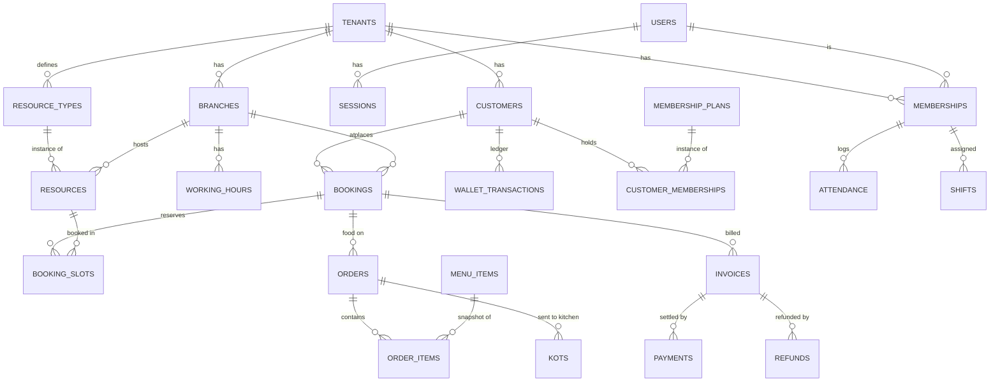

# Arena OS — Data Model (authoritative schema spec)

Column-level schema for **every MVP-1 table**, across all modules. Built tables
(`[built]`) reflect the live migrations (`db/migrations/0001–0005`); planned
tables (`[M1]`…`[M8]`) are the design each module's data-model ticket implements.

Pairs with `docs/ARCHITECTURE.md` (rationale) and `docs/ROADMAP.md` (sequencing).
When a planned table is built, update it here and mark `[built]`.

## Conventions

- **PK:** `id uuid primary key default gen_random_uuid()` unless noted.
- **Tenancy:** every business table has `tenant_id uuid not null references tenants(id) on delete cascade`. Branch-scoped tables also carry `branch_id`.
- **Timestamps:** `created_at timestamptz not null default now()`; mutable tables add `updated_at` (kept fresh by the `set_updated_at()` trigger).
- **Money:** `numeric(10,2)`, non-negative via CHECK; totals are **snapshotted** onto invoices/line-items, never recomputed from live prices.
- **Time:** absolute instants are `timestamptz`; wall-clock config (working hours) is `time`; rendered in the tenant/branch timezone.
- **Ledgers:** wallet/loyalty balances are the **sum of an append-only ledger**, not a stored mutable number.
- **RLS:** default policy `using (tenant_id in (select auth_tenant_ids())) with check (...)`, granted to `arena_app`. Tighter per-role writes noted per table. `users`/`sessions` are global identity — **never granted to `arena_app`**.
- **Scope key:** `[T]` tenant-scoped · `[T/B]` tenant + branch · `[G]` global.

## Relationship overview

---

## Identity & tenancy `[built]`

### `users` `[G]`
`id` · `email text unique not null` · `password_hash text not null` · `full_name text` · `is_platform_admin boolean not null default false` · `created_at` · `updated_at`. Not granted to `arena_app`.

### `sessions` `[G]`
`id text pk` (SHA-256 of the cookie token) · `user_id → users on delete cascade` · `expires_at timestamptz not null` · `created_at`. Index `(user_id)`. Not granted to `arena_app`.

### `tenants`
`id` · `slug text unique` (CHECK subdomain pattern) · `name text not null` · `industry tenant_industry` · `status tenant_status` · `currency text default 'INR'` · `timezone text default 'Asia/Kolkata'` · timestamps.
RLS: member `select`; owner `update`.

### `branches` `[T]`
`id` · `tenant_id` · `name text not null` · `address` · `phone` · `timezone` · `is_primary boolean` · `status branch_status` · timestamps. Unique `(tenant_id, name)`; index `(tenant_id)`. RLS: member `select`, manager write.

### `memberships` `[T/B]`
`id` · `tenant_id` · `user_id → users` · `branch_id → branches null` · `role member_role` · `status member_status` · `full_name` · `email` · `phone` · timestamps. Unique `(tenant_id, user_id)`; indexes `(user_id)`, `(tenant_id)`. RLS: member `select`, manager write.

**Enums:** `tenant_status(trial|active|suspended|cancelled)`, `tenant_industry(gaming_cafe|recording_studio|podcast_studio|dance_studio|vr_centre|other)`, `branch_status(active|inactive)`, `member_role(owner|manager|cashier|kitchen_staff|floor_staff|receptionist)`, `member_status(invited|active|disabled)`.

## Resources & booking `[built]`

### `resource_types` `[T]`
`id` · `tenant_id` · `name` · `description` · `hourly_rate numeric(10,2)` · `buffer_minutes int` · `capacity int null` · `color text` · `is_active boolean` · timestamps. Unique `(tenant_id, name)`.

### `resources` `[T/B]`
`id` · `tenant_id` · `branch_id not null` · `resource_type_id → resource_types` · `name` · `hourly_rate_override numeric null` · `status resource_status` · `sort_order int` · timestamps. Unique `(tenant_id, name)`.

### `working_hours` `[T/B]`
`id` · `tenant_id` · `branch_id not null` · `day_of_week smallint (0–6)` · `open_time time` · `close_time time` · `is_closed boolean` · timestamps. Unique `(branch_id, day_of_week)`; CHECK closed-or-close>open.

### `bookings` `[T/B]`
`id` · `tenant_id` · `branch_id` · `booking_number text` · `customer_name/phone/email` (snapshot) · `status booking_status` · `source booking_source` · `subtotal/discount/tax/total/deposit numeric` · `notes` · `created_by → memberships null` · timestamps · `checked_in_at/completed_at/cancelled_at`. Unique `(tenant_id, booking_number)`. *(M1 adds `customer_id → customers`.)*

### `booking_slots` `[T]`
`id` · `tenant_id` · `booking_id → bookings on delete cascade` · `resource_id → resources` · `starts_at timestamptz` · `ends_at timestamptz` · `rate_applied` · `slot_total` · `resource_name`/`resource_type_name` (snapshot) · `active boolean`.
**Exclusion constraint** `exclude using gist (resource_id with =, tstzrange(starts_at,ends_at) with &&) where (active)` → no overlapping active slot on a resource. Trigger syncs `active` from booking status.

**Enums:** `resource_status(available|maintenance|inactive)`, `booking_status(confirmed|checked_in|completed|cancelled|no_show)`, `booking_source(walk_in|staff|online)`.

---

## M1 — Customers `[M1]`

### `customers` `[T]`
`id` · `tenant_id` · `phone text not null` · `name` · `email` · `dob date` · `tags text[]` · `membership_status text` · `created_at` · `updated_at`. **Unique `(tenant_id, phone)`**; index `(tenant_id)`. RLS member rw.

### `customer_notes` `[T]`
`id` · `tenant_id` · `customer_id → customers on delete cascade` · `body text` · `created_by → memberships null` · `created_at`. Index `(customer_id)`.

### `wallet_transactions` `[T]`  (append-only ledger)
`id` · `tenant_id` · `customer_id → customers` · `amount numeric(10,2)` (signed: + credit / − debit) · `reason text` · `source_type text` (topup|booking|refund…) · `source_id uuid null` · `created_by → memberships null` · `created_at`. Balance = `sum(amount)`. Index `(customer_id)`.

### `loyalty_transactions` `[T]`  (append-only ledger)
`id` · `tenant_id` · `customer_id` · `points int` (signed) · `reason` · `source_type/source_id` · `created_at`. Balance = `sum(points)`.

## M1 — POS / Billing `[M1]`

### `invoices` `[T/B]`
`id` · `tenant_id` · `branch_id` · `invoice_number text` · `booking_id → bookings null` · `customer_id → customers null` · `subtotal` · `discount` · `promo_code_id → promo_codes null` · `tax_total` · `tax_breakup jsonb` (CGST/SGST lines) · `total` · `status invoice_status(draft|issued|paid|void)` · `place_of_supply text` · `issued_at` · timestamps. **Unique `(tenant_id, invoice_number)`**. RLS member rw; void = owner/manager.

### `invoice_items` `[T]`
`id` · `tenant_id` · `invoice_id → invoices on delete cascade` · `kind text(booking|food|membership|adjustment)` · `source_id uuid null` · `description text` · `qty numeric` · `unit_price` · `tax_rate numeric` · `line_total` (all snapshot). Index `(invoice_id)`.

### `payments` `[T/B]`  (split payments = many rows per invoice)
`id` · `tenant_id` · `branch_id` · `invoice_id → invoices` · `method payment_method(cash|card|upi|online|wallet)` · `amount numeric(10,2)` · `status payment_status(pending|captured|failed|refunded)` · `gateway text null` · `gateway_order_id/gateway_payment_id/gateway_signature text null` · `collected_by → memberships null` · `created_at`. Index `(invoice_id)`. CHECK `sum(amount) ≤ invoice.total` enforced in service.

### `refunds` `[T]`
`id` · `tenant_id` · `payment_id → payments` · `amount` · `reason` · `created_by → memberships` · `created_at`. Owner/manager only.

### `promo_codes` `[T]`
`id` · `tenant_id` · `code text` · `discount_type(percentage|fixed)` · `discount_value numeric` · `valid_from/valid_until timestamptz` · `max_uses int null` · `uses int default 0` · `is_active boolean` · timestamps. Unique `(tenant_id, upper(code))`.

### `tax_rates` `[T]`
`id` · `tenant_id` · `name text` · `percent numeric(5,2)` · `is_active boolean` · timestamps.

### `sequences` `[T]`  (per-tenant human numbers)
`tenant_id` · `kind text(booking|invoice|kot)` · `period text` (e.g. YYYYMMDD or YYYY) · `value int`. PK `(tenant_id, kind, period)`. Atomic increment for gap-free per-scope numbering.

### `audit_log` `[T]`
`id` · `tenant_id` · `actor_membership_id → memberships null` · `action text` · `entity_type/entity_id` · `before jsonb` · `after jsonb` · `created_at`. Index `(tenant_id, created_at)`.

## M1 — Settings `[M1]`

### `business_profiles` `[T]`
`tenant_id pk → tenants` · `legal_name` · `gstin text` · `address` · `logo_url` · `invoice_prefix text` · `place_of_supply` · timestamps. Owner-only writes.

**Enums:** `invoice_status`, `payment_method`, `payment_status` (above).

---

## M2 — Food & Kitchen `[M2]`

### `menu_categories` `[T]`
`id` · `tenant_id` · `name` · `sort_order int` · `is_active boolean` · timestamps. Unique `(tenant_id, name)`.

### `menu_items` `[T]`
`id` · `tenant_id` · `category_id → menu_categories` · `name` · `price numeric(10,2)` · `tax_rate_id → tax_rates null` · `status(available|out_of_stock|hidden)` · `image_url` · `happy_hour_eligible boolean` · timestamps.

### `happy_hours` `[T]`
`id` · `tenant_id` · `name` · `days_of_week smallint[]` · `start_time/end_time time` · `discount_type/discount_value` · `is_active boolean` · timestamps.

### `orders` `[T/B]`
`id` · `tenant_id` · `branch_id` · `booking_id → bookings null` · `order_number text` · `status(open|billed|cancelled)` · `created_by → memberships null` · timestamps.

### `order_items` `[T]`
`id` · `tenant_id` · `order_id → orders on delete cascade` · `menu_item_id → menu_items null` · `item_name`/`unit_price`/`tax_rate` (snapshot) · `qty int` · `line_total` · `special_instructions text`.

### `kots` `[T/B]`
`id` · `tenant_id` · `branch_id` · `order_id → orders` · `kot_number text` · `status kot_status(pending|preparing|ready|served|cancelled)` · `created_at` · `updated_at`. Kitchen queue = open KOTs. `kitchen_staff` may update `status`.

---

## M3 — Public booking, Payments, Notifications `[M3]`

*(Public booking reuses `bookings`/`booking_slots`/`customers`; deposits use `payments` with `method=online`.)*

### `payment_settings` `[T]`
`tenant_id pk` · `provider text default 'razorpay'` · `key_id text` · `key_secret_encrypted bytea` (envelope-encrypted; never returned plaintext) · `webhook_secret_encrypted bytea` · `deposit_type(percentage|fixed)` · `deposit_value numeric` · `is_live boolean` · timestamps. Owner-only.

### `notification_settings` `[T]`
`tenant_id pk` · `sms_provider text` · `sms_sender_id text` · `dlt_templates jsonb` (event → template id) · `enabled boolean` · timestamps.

### `notifications` `[T]`  (outbox)
`id` · `tenant_id` · `channel(sms|email|inapp)` · `to_address text` · `template_key text` · `payload jsonb` · `status(queued|sent|failed)` · `attempts int` · `last_error text` · `booking_id null` · `created_at` · `sent_at`. Index `(tenant_id, status)`.

**Booking QR:** `bookings` gains `qr_token text` (unguessable) for `/b/{number}` check-in.

---

## M4 — Employee management

### `attendance` `[T/B]` `[built]`
`id` · `tenant_id` · `branch_id` · `membership_id → memberships` · `work_date date` · `clock_in timestamptz` · `clock_out timestamptz null` · `is_manual boolean` · `note text` · timestamps. Index `(tenant_id, work_date)`, `(membership_id)`. One row per (membership, work_date) in the common case — staff clock in/out their own row; managers may add/correct any row (marks `is_manual = true`). RLS: any active member rw (tenant-scoped); action layer restricts staff to their own membership.

### `rosters` `[T/B]` `[built]`
`id` · `tenant_id` · `branch_id` · `week_start date` · `note text` · timestamps. Unique `(branch_id, week_start)` — one roster per branch per week; the builder upserts on this key.

### `shifts` `[T/B]` `[built]`
`id` · `tenant_id` · `branch_id` · `membership_id → memberships` · `roster_id → rosters null` · `shift_date date` · `type shift_type(morning|evening|night)` · `starts time` · `ends time` · timestamps. Index `(membership_id, shift_date)`. RLS: any active member rw (staff can see the whole roster); action layer restricts building/editing to managers.

**Enums:** `shift_type(morning|evening|night)`.

### `tasks` `[T/B]` `[built]`
`id` · `tenant_id` · `branch_id null` · `title` · `description` · `assigned_to → memberships null` · `status task_status(open|in_progress|done)` · `due_date date null` · `created_by → memberships null` · timestamps. Index `(assigned_to)`. RLS: any active member rw; action layer restricts create/reassign/delete to managers, status updates to the assignee or a manager.

**Enums:** `task_status(open|in_progress|done)`.

*(Performance metrics are **derived** — no table — from `payments.collected_by`, `bookings.created_by`, `attendance`.)*

---

## M5 — Membership & wallet `[M5]`

### `membership_plans` `[T]`
`id` · `tenant_id` · `name` · `price numeric` · `duration_days int` · `benefits jsonb` (`{booking_discount_pct, food_discount_pct, free_hours, credits, special_pricing}`) · `is_active boolean` · `display_order int` · timestamps.

### `customer_memberships` `[T]`
`id` · `tenant_id` · `customer_id → customers` · `plan_id → membership_plans` · `starts_at` · `expires_at` · `is_active boolean` · `amount_paid numeric` · `invoice_id → invoices null` · timestamps. Index `(customer_id, is_active)`, `(expires_at)`.

*(Wallet & loyalty use `wallet_transactions`/`loyalty_transactions` from M1. Wallet as a tender = a `payments` row with `method=wallet` + a debit ledger entry.)*

---

## M6 — Reports `[M6]`

Read-only. No new base tables; prefer **materialized views** / rollups over
`bookings`, `booking_slots`, `invoices`, `payments`, `orders`,
`customer_memberships`, `attendance` — refreshed on a schedule. Examples:
`mv_daily_revenue(tenant_id, branch_id, day, gross, discount, tax, net)`,
`mv_resource_occupancy(tenant_id, resource_id, day, booked_minutes, open_minutes)`.
All filtered by `tenant_id`; export to CSV. (Add a `report_snapshots` table only if
historical immutability is needed.)

---

## M7 / M8 — Hardening & launch `[M7]` `[M8]`

Mostly non-schema (infra, security, ops). Schema touches:
- `audit_log` coverage extended to role/company/gateway-key changes (table exists from M1).
- Optional `rate_limits` (or Redis/edge KV) for throttling counters — likely **not** a Postgres table (use edge KV).
- Data-lifecycle: per-tenant **export** (read) + **hard-delete** (cascades via `tenant_id ON DELETE CASCADE`, already in place).
- Later/deferred: `tenant_domains(tenant_id, hostname unique, verified_at)` for custom domains.

---

## Change log

- 2026-08-01 — Initial full spec. Built tables reflect migrations 0001–0005;
  M1–M8 are the target schema per their data-model tickets. Update table blocks
  to `[built]` as migrations land, keeping `db/schema.ts` in sync.
- 2026-08-05 — Migration 0006 adds `attendance` (M4-A): clock in/out, manager
  correction, marked `[built]`.
- 2026-08-05 — Migration 0007 adds `rosters`/`shifts` (M4-B): weekly roster
  builder, staff shift assignment, marked `[built]`.
- 2026-08-05 — Migration 0008 adds `tasks` (M4-C): manager assigns, assignee
  tracks status, marked `[built]`.
